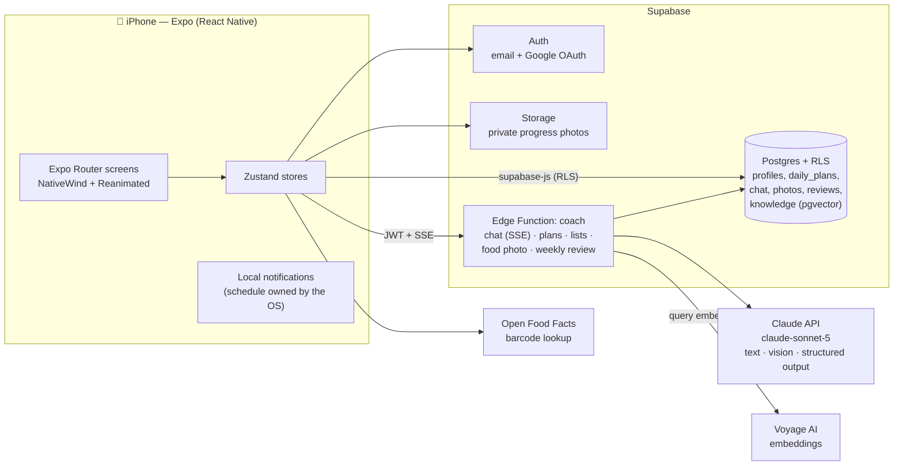

# Sage 🌿

**AI-powered nutrition and personal training coach.** Warm, calm and motivating — built to inspire consistency, never guilt.

Sage builds you a daily plan (meals + workout) that honors your body, goal, budget, allergies, injuries and available equipment; then coaches you through it in a streaming chat backed by a curated knowledge base, reads your food photos to keep the day's calories balanced, tracks progress photos privately, and checks in with you every week — always in warm Mexican Spanish.

## Screenshots

<!-- TODO(screenshots): drop iPhone captures into assets/screenshots/ and
     remove this comment. Suggested shots, in this order: -->

| Home & daily plan | Coach chat (streaming) | Progress | Weekly check-in |
|---|---|---|---|
|  |  |  |  |

| Food photo → log | Shopping list + barcode | Onboarding | Dark mode |
|---|---|---|---|
|  |  |  |  |

<!-- TODO(gif): a short screen recording (chat streaming or checking off the
     daily plan) converted to GIF sells the app better than any still. -->

## Features

- **AI daily plan** — 3–4 meals that hit your computed calorie/protein target (Mifflin-St Jeor) plus a workout that fits your minutes, place and equipment. Regenerating keeps what you already checked off and rebuilds only the rest.
- **Coach chat with RAG** — streams its reply token by token; grounds advice in a curated knowledge base (pgvector + Voyage AI embeddings) and cites its sources; sees today's plan and your latest progress analysis.
- **Food photo logging** — snap your plate, Claude vision estimates the foods and calories, and the day's remaining meals are recalculated around what you actually ate. The image is analyzed and discarded — never stored.
- **Progress photos** — private bucket, pose-aware before/after analysis (front/back/side), weight trend, adherence rings and streaks.
- **Weekly check-in** — adherence recap, warm feedback with body-image guardrails, and exactly one small, safe plan tweak.
- **Diet data** — Open Food Facts barcode scanning and an AI shopping list fitted to your weekly budget in MXN.
- **Safety rails everywhere** — no extreme deficits, injuries respected, allergy-aware, "consult a professional" boundaries, and server-clock generation limits (3/day per feature) so cost can't run away.
- **Auth** — email + password with OTP recovery, or one-tap Google sign-in.

## Architecture



Every request to the Edge Function is JWT-verified and every table is behind row-level security, so the function acts *as the calling user* — there is no trusted client. The Claude API key never leaves the server.

## Stack

- **React Native + Expo (SDK 54) + TypeScript (strict)** — runs in Expo Go during development
- **Expo Router** (file-based navigation) · **NativeWind v4** (Tailwind for RN) · **Reanimated**
- **Supabase** — Auth, Postgres with RLS, Storage, Edge Functions (Deno), pgvector
- **Claude API** (`claude-sonnet-5`) — plan generation with structured outputs, streaming chat, vision (food + progress photos)
- **Voyage AI** (`voyage-3.5`) — embeddings for the coach's knowledge base
- **i18next** — Spanish (es-MX) first

## Getting started

```bash
npm install
cp .env.example .env   # fill in your Supabase project URL + anon key
npx expo start
```

Scan the QR code with [Expo Go](https://expo.dev/go) on your phone (same Wi-Fi network).

Server-side setup (once): apply `supabase/migrations/` in order, deploy `supabase/functions/coach` with an `ANTHROPIC_API_KEY` secret (plus optional `VOYAGE_API_KEY` for RAG), and ingest the knowledge base with `node scripts/ingest-knowledge.mjs`. To ship a real build, see the [EAS Build guide](docs/eas-build.md).

## Project structure

```
src/
  app/          # Routes (Expo Router)
  components/   # Reusable UI
  features/     # auth, onboarding, diet, workout, coach, progress
  lib/          # supabase client, LLM provider, external APIs, RAG, i18n
  theme/        # Design tokens (single source of truth)
supabase/       # SQL migrations, Edge Functions, knowledge base
docs/           # EAS Build guide
```

## Lessons learned

- **Charset bugs hide in the transport.** React Native on iOS decodes HTTP bodies without an explicit charset as Latin-1, which garbled every accented character coming out of the Edge Function. The fix that can't regress: serialize responses (and each SSE event) as pure-ASCII JSON, escaping everything else as `\uXXXX` — immune to whatever the decoder assumes.
- **Streaming in React Native needs `expo/fetch`.** RN's built-in `fetch` can't consume `ReadableStream` bodies; Expo's WinterCG-compliant fetch can, which is what makes token-by-token SSE chat possible in Expo Go.
- **Model choice is a product decision, not a benchmark.** Haiku misread a strawberry cheesecake as a ham tart; food-photo logging moved to Sonnet and the complaint disappeared. Meanwhile chat quality was fine on either — pay for eyes only where eyes matter.
- **Adaptive thinking can eat your output budget.** Sonnet 5 spends thinking tokens from `max_tokens`, which silently truncated structured-output JSON. Disabling thinking explicitly on every server call made generation deterministic in cost and shape.
- **Design for regeneration, not generation.** Users regenerate plans mid-day. Keeping completed items fixed and rebuilding only the remainder (same pattern for shopping lists and food-photo recalculation) turned the most-used feature from destructive to trustworthy.
- **Rate-limit on the server clock.** Free AI features invite abuse as soon as the device clock is the referee. A rolling 24 h window counted in Postgres (3 generations/day per feature) closed it with one table.
- **External APIs disappear.** wger removed its exercise-search API mid-project; a curated local catalog of verified IDs proved more reliable than any third-party search. Expo Go likewise dropped remote push — local notifications with the schedule owned by the OS turned out simpler *and* more private.
- **Guardrails are a feature.** Body-image-safe prompts, opt-in photo analysis, allergy hard rules, injury-aware workouts and "one safe tweak per week" are what make an AI coach shippable, not an afterthought.

## Build history

<details>
<summary>18 phases from empty repo to launch polish</summary>

| Phase | Scope |
|---|---|
| 1–2 | Expo + NativeWind + design tokens + welcome; Supabase auth (email/password, OTP recovery, RLS) |
| 3–4 | Onboarding & profile with TDEE (Mifflin-St Jeor); AI daily plan with structured outputs & partial regeneration |
| 5–7 | Coach chat with plan context; progress photos (private bucket, vision compare); dark mode + brand shapes |
| 8–10 | Env-gated donations; CI (lint + typecheck); Open Food Facts + barcode + AI shopping list |
| 11 | Progress screen: adherence rings, weight trend, streaks, celebrations; meal variety memory in prompts |
| 12 | Shopping list within budget; barcode scanner; training-equipment picker feeding plan generation |
| 13 | wger exercise sheets (curated catalog after wger's search API vanished); server-clock generation limits; photo poses |
| 14 | Coach RAG (pgvector + Voyage AI + source citations); ephemeral food-photo logging |
| 16 | Local reminders (Expo Notifications); food photo moved to Sonnet after Haiku misread desserts |
| 17 | Weekly check-in with adherence + RAG + one safe tweak; food photo recalculates the day server-side; scan limits; list cleanup; minute-level reminders |
| 18 | Launch polish: Google OAuth, SSE chat streaming, portfolio README, [EAS Build guide](docs/eas-build.md) |

</details>

## Health disclaimer

Sage provides general wellness guidance, **not medical advice**. Always consult a health professional.

## License

[MIT](LICENSE)
