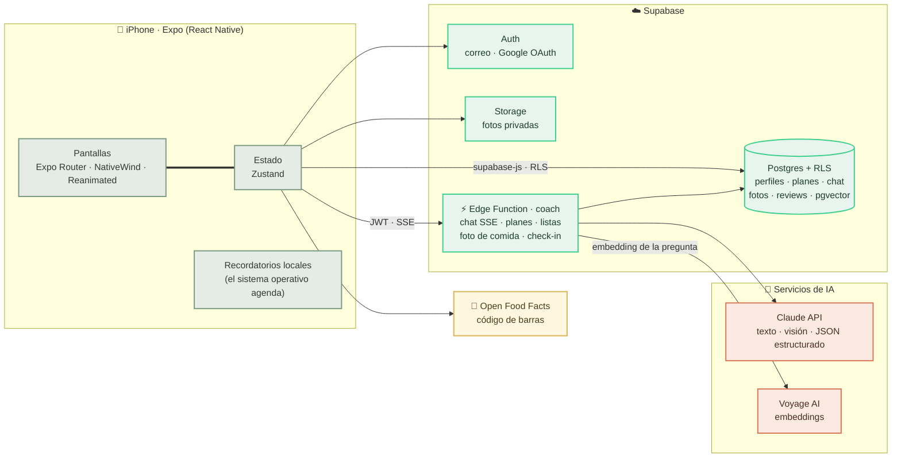

<div align="center">

# 🌿 Sage

### Tu coach de nutrición y entrenamiento con IA

*Cálido, constante y sin culpas — diseñado para inspirar hábitos, nunca para juzgarte.*

<br/>


</div>

---

**Sage** construye tu día completo — comidas que cuadran con tus calorías y un entrenamiento a tu medida — respetando tu cuerpo, tu meta, tu presupuesto, tus alergias, tus lesiones y el equipo que tienes a la mano. Te acompaña con un chat que responde en tiempo real, respaldado por una base de conocimiento con citas; lee fotos de tu comida para recuadrar el día, cuida tu progreso con fotos privadas y cierra cada semana con un check-in amable. Todo en español mexicano.

## ✨ Qué hace

- 🍽️ **Plan diario con IA** — 3 o 4 comidas que suman tu objetivo calórico (Mifflin-St Jeor) y un entrenamiento que cabe en tus minutos, tu lugar y tu equipo. Al regenerar, lo que ya palomeaste se queda: solo se reconstruye el resto.
- 💬 **Coach con RAG y streaming** — el chat escribe su respuesta token por token, fundamenta sus consejos en una base de conocimiento curada (pgvector + embeddings de Voyage AI) y cita sus fuentes. Ve tu plan de hoy y tu último análisis de progreso.
- 📸 **Foto de comida → registro** — le tomas foto a tu plato, la visión de Claude estima alimentos y calorías, y las comidas restantes del día se recalculan alrededor de lo que realmente comiste. La imagen se analiza y se descarta: jamás se guarda.
- 🏃 **Progreso que motiva** — anillos de adherencia diarios y semanales estilo Apple Fitness, barra de calorías del día con avisos amables, tendencia de peso, rachas y celebraciones. Fotos de progreso en bucket privado con análisis por pose (frente/espalda/perfil).
- 📅 **Check-in semanal** — resumen de adherencia, feedback cálido con guardarraíles de imagen corporal, y exactamente *un* ajuste pequeño y seguro por semana.
- 🛒 **Datos de dieta reales** — escáner de código de barras (Open Food Facts) y lista del súper generada por IA que cabe en tu presupuesto semanal en MXN.
- 🛡️ **Seguridad por diseño** — sin déficits extremos, lesiones y alergias respetadas siempre, límites de "consulta a un profesional", y cuotas de generación del lado del servidor (3/día por función) para que el costo nunca se dispare.
- 🔐 **Auth flexible** — correo + contraseña con recuperación por código, o un toque con Google.

## 📱 Capturas

> 🚧 *Próximamente — la app está en uso diario y las capturas llegan con la primera gran actualización.*

<!-- TODO(screenshots): assets/screenshots/ → home, coach (streaming), progreso,
     check-in, foto de comida, súper, onboarding, dark mode + GIF del chat. -->

## 🧭 Arquitectura



Cada petición a la Edge Function se verifica con JWT y cada tabla vive detrás de *row-level security*: la función actúa **como el usuario que llama** — no existe un cliente confiable. La llave de la API de Claude nunca sale del servidor.

## 🛠️ Stack

| Capa | Tecnología |
|---|---|
| App | React Native + Expo SDK 54 · TypeScript estricto · Expo Router · NativeWind v4 · Reanimated |
| Backend | Supabase — Auth, Postgres con RLS, Storage, Edge Functions (Deno), pgvector |
| IA | Claude API (`claude-sonnet-5`) — generación con salidas estructuradas, chat con streaming, visión |
| Embeddings | Voyage AI (`voyage-3.5`) para la base de conocimiento del coach |
| Datos | Open Food Facts (código de barras) · catálogo curado de ejercicios |
| i18n | i18next — español (es-MX) primero |

## 🚀 Cómo correrlo

```bash
npm install
cp .env.example .env   # llena la URL y anon key de tu proyecto Supabase
npx expo start
```

Escanea el QR con [Expo Go](https://expo.dev/go) en tu teléfono (misma red Wi-Fi).

Del lado del servidor (una sola vez): aplica las migraciones de `supabase/migrations/` en orden, despliega `supabase/functions/coach` con el secret `ANTHROPIC_API_KEY` (y `VOYAGE_API_KEY` opcional para el RAG), e ingiere la base de conocimiento con `node scripts/ingest-knowledge.mjs`. Para generar una build instalable, sigue la [guía de EAS Build](docs/eas-build.md).

## 📁 Estructura

```
src/
  app/          # Rutas (Expo Router)
  components/   # UI reutilizable
  features/     # auth, onboarding, dieta, entrenamiento, coach, progreso
  lib/          # cliente supabase, i18n, APIs externas
  theme/        # Tokens de diseño (única fuente de verdad)
supabase/       # Migraciones SQL, Edge Functions, base de conocimiento
docs/           # Guía de EAS Build
```

## 📚 Lecciones aprendidas

- **Los bugs de charset se esconden en el transporte.** React Native en iOS decodifica cuerpos HTTP sin charset explícito como Latin-1, y cada acento salía garbleado de la Edge Function. La cura definitiva: serializar cada respuesta (y cada evento SSE) como JSON puramente ASCII, escapando todo lo demás como `\uXXXX` — inmune a lo que el decodificador asuma.
- **Streaming en React Native exige `expo/fetch`.** El `fetch` nativo de RN no consume cuerpos `ReadableStream`; el de Expo (WinterCG) sí — es lo que hace posible el chat token por token dentro de Expo Go.
- **Los globs de redirect de Supabase no cruzan puntos.** El OAuth de Google moría en silencio porque ningún patrón de la allowlist — ni la URL exacta — hace match con un host tipo IP (`exp://192.168.3.90:8081/...`). Se diagnosticó sondeando GoTrue con `curl` y leyendo el header `Location`; el fix fue un host de redirect sin puntos, porque el navegador intercepta por *esquema*, no por host.
- **Elegir modelo es decisión de producto, no de benchmark.** Haiku confundió un cheesecake de fresa con una tarta de jamón; la foto de comida se movió a Sonnet y la queja desapareció. El chat funcionaba igual de bien en ambos: paga por buenos ojos solo donde los ojos importan.
- **El razonamiento adaptativo se puede comer tu presupuesto de salida.** Sonnet 5 gasta tokens de *thinking* del mismo `max_tokens`, lo que truncaba el JSON estructurado en silencio. Deshabilitarlo explícitamente en cada llamada volvió la generación determinista en costo y forma.
- **Diseña para la regeneración, no para la generación.** La gente regenera su plan a media tarde. Conservar lo completado y reconstruir solo el resto (mismo patrón en la lista del súper y el recálculo por foto) convirtió la función más usada de destructiva a confiable.
- **Limita en el reloj del servidor.** Una función de IA gratis invita al abuso en cuanto el árbitro es el reloj del dispositivo. Una ventana móvil de 24 h contada en Postgres (3 generaciones/día por función) lo cerró con una sola tabla.
- **Las APIs externas desaparecen.** wger eliminó su API de búsqueda de ejercicios a medio proyecto; un catálogo local curado de IDs verificados resultó más confiable que cualquier búsqueda de terceros. Expo Go igual eliminó el push remoto — las notificaciones locales, con la agenda en manos del sistema operativo, terminaron siendo más simples *y* más privadas.
- **Los guardarraíles son una feature.** Prompts seguros con la imagen corporal, análisis de fotos opt-in, alergias como regla dura, entrenamientos que respetan lesiones y "un solo ajuste seguro por semana" son lo que hace publicable a un coach con IA — no una ocurrencia tardía.

## 🗺️ Historial de construcción

<details>
<summary><b>18 fases: de repo vacío a lanzamiento</b></summary>

<br/>

| Fase | Alcance |
|---|---|
| 1–2 | Expo + NativeWind + tokens de diseño + bienvenida; auth de Supabase (correo/contraseña, recuperación por código, RLS) |
| 3–4 | Onboarding y perfil con TDEE (Mifflin-St Jeor); plan diario con IA, salidas estructuradas y regeneración parcial |
| 5–7 | Chat del coach con contexto del plan; fotos de progreso (bucket privado, comparación con visión); modo oscuro |
| 8–10 | Donaciones opcionales; CI (lint + typecheck); Open Food Facts + código de barras + lista del súper con IA |
| 11 | Pantalla de progreso: anillos de adherencia, tendencia de peso, rachas, celebraciones; memoria de variedad en los prompts |
| 12 | Lista del súper dentro del presupuesto; escáner; selector de equipo de entrenamiento que alimenta la generación |
| 13 | Fichas de ejercicios (catálogo curado tras la desaparición de la API de wger); límites de generación con reloj del servidor; poses de foto |
| 14 | RAG del coach (pgvector + Voyage AI + citas de fuentes); registro efímero de fotos de comida |
| 16 | Recordatorios locales (Expo Notifications); foto de comida a Sonnet tras el incidente del cheesecake |
| 17 | Check-in semanal; la foto de comida recalcula el día del lado del servidor; límites de escaneo; limpieza de lista; minutos en recordatorios |
| 18 | Pulido de lanzamiento: Google OAuth, streaming SSE del chat, anillo semanal + barra de kcal, README, [guía EAS](docs/eas-build.md), publicación OTA |

</details>

## ⚠️ Aviso de salud

Sage ofrece orientación general de bienestar, **no consejo médico**. Consulta siempre a un profesional de la salud.

## 📄 Licencia

[MIT](LICENSE)

---

<div align="center">

*Hecho con 🌿 en México*

</div>
